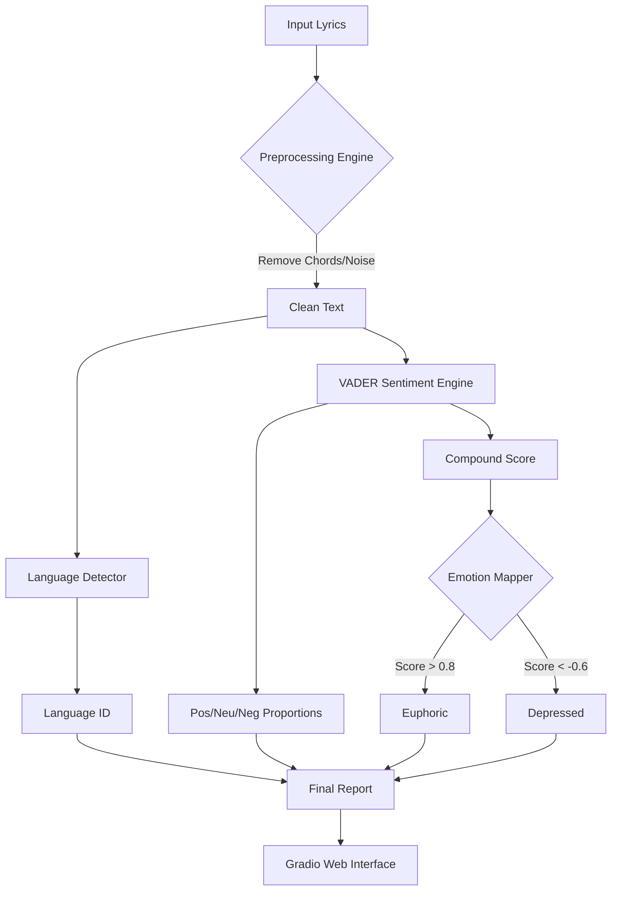

# 🎵 Music Intelligence System

> **Advanced Language & Emotion Analysis Engine for Song Lyrics**
> *Powered by NLP, NLTK VADER, and Gradient Boosting*

## 📖 Project Overview
The **Music Intelligence System** is a sophisticated NLP (Natural Language Processing) pipeline designed to deeply analyze the lyrical content of songs. It moves beyond simple "positive/negative" sentiment to provide a nuanced emotional profile and accurate language identification for any song lyrics.

This project is built to run seamlessly in **Google Colab** with a modern, interactive web interface.

---

## 🚀 Key Features

### 1. 🌍 Polyglot Language Detection
Automatically identifies the language of the lyrics with high precision.
- Supports **English, Spanish, French, German, Italian, Portuguese, Korean, Japanese**, and more.
- Uses statistical character n-gram analysis (`langdetect`) to robustly handle short and long texts.

### 2. 🎭 Advanced Emotion Profiling
Unlike basic sentiment analysis, this system maps the lyrical content to a **5-point Emotional Spectrum** using the **NLTK VADER** (Valence Aware Dictionary and sEntiment Reasoner) engine:

| Status | Compound Score | Description | Color Indicator |
| :--- | :--- | :--- | :--- |
| **🤩 Euphoric** | `> 0.8` | Extreme happiness, excitement, celebration | 🟢 Green |
| **🙂 Happy** | `0.4 - 0.8` | General positivity, contentment, joy | 🟢 Light Green |
| **😐 Neutral** | `-0.2 - 0.4` | Calm, narrative, objective storytelling | 🔘 Gray |
| **😟 Sad** | `-0.6 - -0.2` | Melancholy, longing, minor distress | 🟠 Orange |
| **😭 Depressed** | `< -0.6` | Deep sadness, grief, anger, despair | 🔴 Red |

### 3. 🧠 Smart Corpus Integration
- **Kaggle Integration**: The system is capable of downloading the massive `eitanbentora/chords-and-lyrics-dataset` to build a robust knowledge base.
- **Robust Authentication**: Features a smart authentication mechanism that handles `kaggle.json` credentials automatically, even in restricted environments like Colab.

### 4. 💻 Modern Interactive UI
- Built with **Gradio**, the interface provides a clean, app-like experience.
- **Real-time Visualization**: See the sentiment breakdown (Positive vs. Neutral vs. Negative) in an interactive chart.
- **Rich Text Reports**: Get a formatted markdown report for every analysis.

---

## 🛠️ System Architecture



---

## 🏃 How to Run (Google Colab Recommended)

The project is optimized for Google Colab usage.

### Step 1: Get Your Kaggle Credentials (Optional)
*Notes: The system works without this, but this unlocks the full dataset features.*
1. Go to your [Kaggle Settings](https://www.kaggle.com/settings).
2. Scroll to **API** section and click **Create New Token**.
3. A file named `kaggle.json` will be downloaded.

### Step 2: Run the Script
1. Upload the `music_intelligence_advanced.py` script to Colab.
2. (Optional) Upload your `kaggle.json` to the **Files** sidebar in Colab.
3. Run the script!

```python
!python music_intelligence_advanced.py
```

### Step 3: Use the UI
- The script will generate a **Public URL** (e.g., `https://xxxx.gradio.live`).
- Click it to open the Music Intelligence App in your browser.
- Paste any lyrics and click **Analyze**.

---

## 📦 Dependencies

*   `pandas` & `numpy`: Data manipulation.
*   `nltk`: The core NLP library for tokenization and VADER sentiment.
*   `langdetect`: For accurate language identification.
*   `gradio`: For the web-based user interface.
*   `kaggle`: For authenticating and downloading datasets.

---

## 🔮 Future Roadmap
- [ ] **Transformer Models**: Upgrade to BERT-based sentiment analysis for context-aware emotion detection.
- [ ] **Spotify Integration**: Allow users to paste a Spotify URL instead of raw lyrics.
- [ ] **Genre Classification**: Machine learning model to predict rock, pop, jazz, etc. based on lyrical structure.

---
**Author**: Antigravity (Google DeepMind)
**License**: MIT
